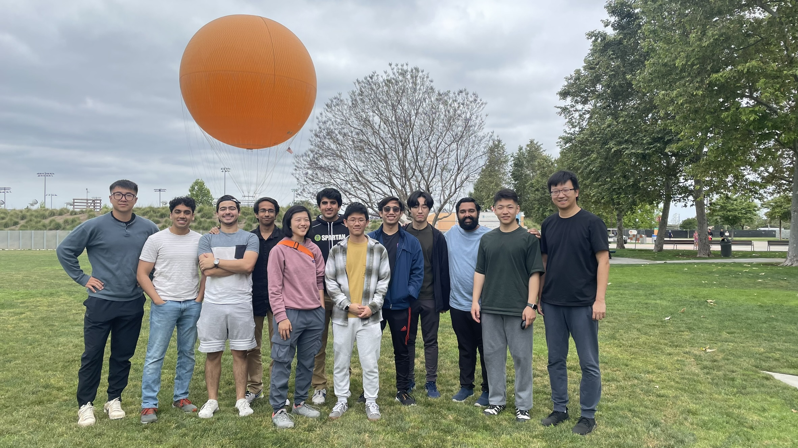



<h2>Faculty</h2>
 
 
     
         
     


 

<h2>Graduate Students</h2>
 
 
     
                
     

 
     
                
     


 

<h2>Undergraduate Students</h2>
 

    
                
    


<h2>Visiting Students</h2>
 

    
                
    




<h2>Alumni</h2>
 

    
                
    


<h2>Past Visitors</h2>
 

    
                
    


